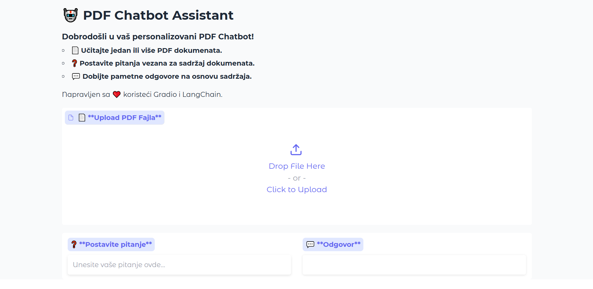

# 🤖 Personalized PDF Chatbot

Welcome to **Personalized PDF Chatbot** project! This application allows users to upload PDF documents and ask questions based on the content of those documents. It uses **Gradio** for the front-end interface and **LangChain** for natural language processing with **OpenAI's GPT-4**.

---

## 🖼️ **Project Preview**



---

## 📋 **Project Features**

- Upload and process **one or more PDF documents**.
- **Search and retrieve answers** from uploaded documents using OpenAI's GPT-4.
- **Interactive chat interface** with context-based responses.
- **Local deployment** using Gradio.

---

## 🛠️ **Technologies Used**

- **Python**
- **Gradio** for the user interface
- **LangChain** for document processing
- **OpenAI API** for generating responses
- **Chroma** for vector storage

---

## 📂 **Project Structure**

```plaintext
NoviChatbot/
├── main.py               # Main application script
├── requirements.txt      # Dependencies for the project
├── .gitignore            # Git ignore rules
├── venv/                 # Virtual environment (optional)
└── README.md             # Project documentation
```

---

## ⚙️ **Installation and Setup**

Follow these steps to run the project locally:

### 1️⃣ **Clone the Repository**

```bash
git clone https://github.com/your-username/NoviChatbot.git
cd NoviChatbot
```

### 2️⃣ **Set Up a Virtual Environment** (optional but recommended)

```bash
python -m venv venv
source venv/bin/activate   # On Linux/Mac
venv\Scripts\activate     # On Windows
```

### 3️⃣ **Install Dependencies**

```bash
pip install -r requirements.txt
```

### 4️⃣ **Set Up Your API Key**

Create a `.env` file in the root directory and add your **OpenAI API key**:

```
OPENAI_API_KEY=your_openai_api_key_here
```

### 5️⃣ **Run the Application**

```bash
python main.py
```

The application will run locally, and you can access it at:

```
http://127.0.0.1:7860/
```

---

## 🧪 **Usage**

1. Upload a PDF document using the provided interface.
2. Ask a question related to the content of the PDF.
3. Receive a context-based response from the chatbot.

---

## 🚀 **Deploy to GitHub**

To deploy this project to GitHub:

1. Create a new repository on GitHub.
2. Add all files to your local repository:
   ```bash
   git add .
   git commit -m "Initial commit"
   git branch -M main
   git remote add origin https://github.com/plavsic-marko/NoviChatbot.git
   git push -u origin main
   ```

---

## 📄 **License**

This project is licensed under the **MIT License**. Feel free to modify and distribute it as you like.

---

## 🙋 **Contributing**

Contributions are welcome! Feel free to open issues or submit pull requests.

---

## 📞 **Contact**

If you have any questions or need further assistance, feel free to reach out:

- **Email**: plavsicmarko10@gmail.com
- **GitHub**: [https://github.com/plavsic-marko](https://github.com/plavsic-marko)
